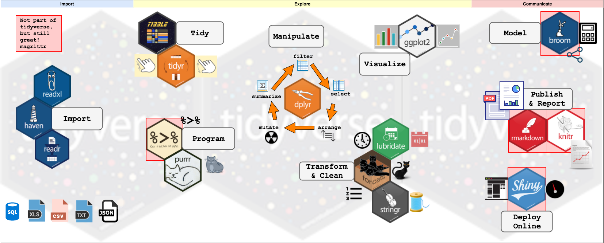
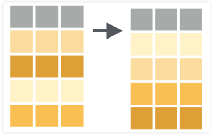
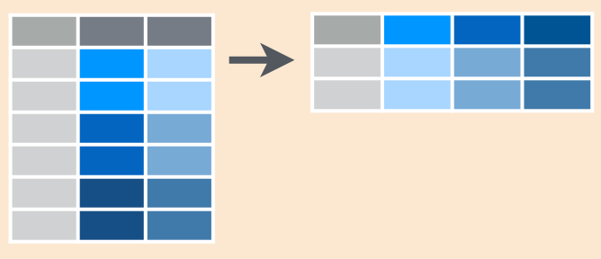

```{r setup, include=FALSE}
knitr::opts_chunk$set(fig.path = "static/img/", echo = TRUE, cache = TRUE)
source("setup.R")
```

# <br><br>Curso de R<br><small> <br><br> MiDaS</small>{ .center .white data-background="#75AADB" }

# Introduccion a R{ .center .white data-background="#75AADB" }

## Descarga e Instalación

- R, el software computacional, se descarga desde el [CRAN](http://cran.r-project.org). Debes elegir la opción que corresponda con tu sistema operativo.
- Rstudio, el panel de control, se descarga desde [Rstudio](http://www.rstudio.com). Elegir la primera opción, "RStudio Desktop Open Source License". 
- Instalar ambos programas de la forma usual.
- Además existe una versión online, [Rstudio Cloud](http://rstudio.cloud)

## Interfaz básica de RStudio


## Primeras Interacciones con R{ .center .white data-background="#75AADB" }

## R como calculadora aritmética

En R se pueden realizar todas las operaciones aritméticas:
  
```{r}
sqrt(2^4 + exp(3)/55 - log(5*8-2)) 
```

**Nota:** Para correr código desde el editor, utilizar *ctrl + enter*.

## R como calculadora lógica

Además, se pueden realizar operaciones lógicas(&,\|), las cuales retornan como resultado TRUE o FALSE:
  
```{r}
38 >= 15
3 < 5 & 6 < 5
3 < 5 | 6 < 5 
```

## Objetos básicos de R

En R podemos guardar objetos utilizando las asignación '\<-' o, en su defecto, '='.

```{r}
a <- 20 # Valor numérico
b = 3^2
c <- "Hola Mundo" # String o carácter.
```

Para visualizar un objeto en consola, basta con escribir su nombre en ella, o bien ejecutar la línea deseada desde el editor.

```{r}
a + b
```

## Objetos básicos de R: Vectores

Para crear un vector se ocupa la función **c()**. Además podemos crear secuencias con la función **seq()**.
```{r}
x <- c(5,b,7,8,-8,20,7,a)
x
y <- seq(1,10)
y
```

## Objetos básicos de R: Vectores

Podemos acceder a un elemento de un vector en una posición específica de un vector utilizando '[]'. Algunos ejemplos:

```{r}
x[3] # Elemento en la posición 3
x[2:4] # Elementos en las posiciones 2 y 4 inclusive
``` 

## Objetos básicos de R: Vectores

```{r}
x[c(5,8)] # Elementos en la posición 5 y 8 
x[-4] # Vector original sin el elemento en la posición 4
```

## Objetos básicos de R: Funciones

La principal herramienta para trabajar con los diferentes objetos en R son las funciones. Algunos ejemplos son:
  
- `sum()`
- `mean()`
- `which()`
- `summary()`

----

**Importante:** Si deseas saber como utilizar una función en específico puedes hacer `?nombre_funcion()`. También puedes buscar [aquí](https://www.google.com).

```{r}
mean(x)
summary(y)
```


## Objetos básicos de R: Paquetes

Los paquetes de R son el eje central de su funcionamiento. En cada uno de ellos existen funciones desarrolladas para resolver diferentes tipos de problemáticas. En esta ocasión instalaremos y cargaremos el paquete 'Tidyverse':
  

## Objetos básicos de R: Paquetes

Para utilizar un paquete en R hay que realizar las siguientes operaciones:
  
- Instalar el paquete, **install.packages('nombre_paquete').** 
- Cargar el paquete,  **library('nombre_paquete')**.

```{r, message = FALSE}
# install.packages('tidyverse')
library(tidyverse)
```

## Objetos básicos de R: `tibbles`

Corresponden a una forma de guardar bases de datos en `R`. 

```{r}
data <- tibble("Sexo" = c("H","M","H","M"), "Edad" = c(20,18,19,30))
data
```

## Objetos básicos de R: `tibbles`

Puedes acceder a los elementos de un `tibble` utilizando `[,]`

```{r}
data[1,2]
data[1,]
```

## Objetos básicos de R: `tibbles`

```{r}
data[,2]
```

- Además, se puede acceder a una columna específica de la BD utilizando su nombre 

```{r}
data$Sexo
```

## Operador %>% 

Permite realizar composición de funciones. Un ejemplo de su utilización es:
  
```{r}
x %>% mean() %>% log()
log(mean(x))
```

## Actividad 1

- Genere un vector con los primeros 1000 números impares.
- Del vector anterior, obtenga los impares número 1, 10, 100 y 1000.
- Cálcule la suma de la raíz de los números generados antes utilizando 2 métodos diferentes.

# Manejo de Base de Datos{ .center .white data-background="#75AADB" }

## Orígen de la BD

Los datos pueden provenir de muchas fuentes:
  
- Archivos de texto(txt ó csv)
- Excel(xlsx)
- SPSS(sav)
- SQL(sql)
- STATA(dta)
- Una página web.
- etc.

## Funciones para Importar

Cada fuente tiene su función de importación en tidyverse.

- Si es csv: **read_csv**.
- Si es texto: **read_delim**.
- Si es excel: **read_excel**.
- Si es spss: **read_sav**.

Para más información, pueden entrar al siguiente [torpedo](https://resources.rstudio.com/spanish-pdfs/data-import-cheatsheet-spanish).

## Ejemplo: storms.csv

La base de datos storms se encuentra en el siguiente [link](https://raw.githubusercontent.com/rstudio/EDAWR/master/data-raw/storms.csv).

```{r}
url  <- 'https://raw.githubusercontent.com/rstudio/EDAWR/master/data-raw/storms.csv'
download.file(url, "storms.csv", mode = "wb")

library(readr)
storms <- read.csv('storms.csv', header = T)
storms
```

## Ejemplo: storms.csv

El comando **glimpse()** nos otorga características de las columnas(variables) de la BD.
```{r}
glimpse(storms)
```

## Ejemplo: numeros.xlsx

```{r}
library(readxl)
numeros <- read_excel('Datasets/numeros.xlsx')
numeros
```

## Ejemplo: submuestra.dta

```{r}
library(haven)
submuestra <- read_dta("Datasets/submuestra ENE 2018 07 JJA.dta")
head(submuestra)
```


## filter(): *Seleccionar filas*

Permite seleccionar filas de cierta BD utilizando un criterio particular.


## filter(): *Código*

```{r}
filter(storms, storm %in% c("Alberto", "Ana"))

storms %>%
  filter(storm %in% c("Alberto", "Ana"))
```

## select(): *Seleccionar Columnas*

Permite seleccionar columnas de una base de datos en específico.


## select() : *Código*

```{r}
select(storms, storm, pressure)
storms %>%
  select(storm, pressure)
```

## select(): *Código alternativo*

```{r}
storms %>%
  select(-wind, -date)

```

## arrange(): *Ordenar filas*

Permite ordenar de menor a mayor una BD teniendo en consideración una o más variables.



## arrange(): *Código*

```{r}
arrange(storms, wind)
storms %>%
  arrange(wind)
```

## arrange(): *Código de mayor a menor*

```{r}
storms %>%
  arrange(desc(wind))
```

## mutate(): *Crear/Modificar Columnas*

Permite crear o modificar una columna de la BD.


## mutate(): *Código*

```{r}
storms %>%
  mutate(ratio = pressure/wind, inverse = 1/ratio)
```

## summarise(): *Resumir Columnas*

Permite aplicar funciones de resumen en las columnas de una BD.


## summarise(): *Código*
```{r}
storms %>% 
  summarise(promedio = mean(wind), desviación_standard = sd(wind))
```

## group_by + summarise: *Resumir Columnas por Grupos*

Group_by divide la base de datos en grupos, lo cual permite obtener medidas de resumen por grupos utilizando summarise.


## group_by + summarise: *Código*

```{r, cache = FALSE}
pollution <- read.csv("https://raw.githubusercontent.com/rstudio/EDAWR/master/data-raw/pollution.csv")
```

```{r}
pollution %>%
  group_by(city) %>%
  summarise(promedio = mean(amount),
            suma = sum(amount),
            n = n(),
            max = max(amount))
```

## mutate + case_when: *Creación de indicadores*

**case_when()** es una función que permite, en conjunto con **mutate()**, generar variables indicadoras.

```{r}
pollution %>% 
  mutate(mayor_30 = case_when(
    amount > 30 ~ 1,
    TRUE ~ 0)) -> pollution2
pollution2
```

----

Se pueden crear variables con más de 2 valores:
  
```{r}
pollution2 %>% 
  mutate(categorias = case_when(
    amount >= 14 & amount < 24 ~ '[14,23]',
    amount >= 24 & amount < 57 ~ '[24,56]',
    TRUE ~ '>56'
  )) -> pollution2
pollution2
```


## Importar datos

```{r, message = FALSE}
songs <- read_csv("Datasets/songs.csv")
songs
```

----
  
```{r}
artists <- read_csv("Datasets/artists.csv")
artists
```

## Rename: *Renombrar columnas*

Permite cambiar los nombres de las columnas seleccionadas

```{r}
artists %>%
  rename(Nombres = name) -> artist2
artist2
```

## join: *Juntar bases de datos*

Existen 7 funciones, en dplyr, que permiten juntar/contrastar dos bases de datos en una sola, utilizando una columna como link. Algunos ejemplos son:
  
  - **inner_join()**
  - **left_join()**
  - **right_join()**
  
## **left_join**: *Ejemplo*
  
  

## Algunos otros ejemplos:

```{r}
artist3 <- inner_join(songs, artists, by = "name")
artist3
artist4 <- right_join(songs, artists, by = "name")
artist4
```
----
  
¿Qué pasa si las columnas links poseen 2 nombres diferentes?
  
```{r}
left_join(songs,artist2, by = c("name" = "Nombres"))
```

## gather: *Reunir columnas*

Coloca nombres de columnas en una variable (columna) __key__, recolectando los 
valores (__value__) de las columnas en un __sola__ columna


## gather: *Código*

```{r}
table4ag <- gather(table4a, `1999`, `2000`, key = "year", value = "cases")
table4ag
```

## spread: *Esparcir*

Esparce un par de columnas (2, key-value) en multiples columnas 



## spread: *Código*

```{r}
table2s <- spread(table2, type, count)
table2s
```

## Actividad 2

- Cargue la base de datos Encuesta.xlsx.
- Seleccione Región, Sexo, Edad, cuánto gastó en seguridad y Score Socioeconómico. Filtre según hombres de Valparaíso.
- Ordene de menor a mayor la edad. Genere un indicador para la variable edad.
- Añada una nueva variable denominada PRSC, calculada como el Score del individuo dividido por el máximo del score observado.
- Obtenga el promedio del PRSC para cada grupo de gasto en seguridad.

**Nota:** Cada ítem se realiza utilizando la base de datos resultante del ítem anterior

# Analisis exploratorio y visualizacion de datos { .center .white data-background="#75AADB"}

## Definición técnica
  
Representación gráfica de datos __codificando la información__ como: posición, tamaño, formas, colores


  
## Algunos gráficos
  
  
  
## Visualizando con ggplot2

Características:
  
- Paquete para visualizar datos mediante capas
- Es muy poderoso y flexible
- Se carga junto al `tidyverse`
- No es la única opción en R para graficar

## Datos

```{r, echo = FALSE}
theme_set(theme_gray())
```

```{r, echo=TRUE}
library(gapminder)
data(gapminder)
paises <- gapminder %>% 
  filter(year == max(year))
paises
```

## Creando un gráfico

```{r, echo=TRUE,  fig.height = 4}
ggplot(data = paises)
```

## Mejorando un gráfico

```{r, echo=TRUE,  fig.height = 4}
ggplot(data = paises) + 
  geom_point(mapping = aes(x = lifeExp, y = gdpPercap))
```

## Que sucedió?

```r
ggplot(data = paises) + 
  geom_point(mapping = aes(x = lifeExp, y = gdpPercap))
```
  
- `ggplot()` crea un sistema de coordenadas al cual se pueden agregar capas
- `ggplot(data = paises)` da un grafico vacío pues no agregamos capas
- `geom_point()` agrega una capa de puntos al gráfico usando las filas de `paises`

----

- Cada función `geom_algo` tiene un argumento de mapping que define cómo se asignan o se “mapean” las variables del conjunto de datos a propiedades visuales del `geom_algo`
-  El argumento de mapping siempre aparece emparejado con `aes()`, y los argumentos `x` e `y` especifican qué variables asignar a los ejes `x` e `y`
- Para más gráficos, pueden visitar el siguiente [link](http://www.sthda.com/english/wiki/be-awesome-in-ggplot2-a-practical-guide-to-be-highly-effective-r-software-and-data-visualization)

----
  
Podemos setear las propiedades estéticas de tu geom manualmente:
  
```{r, echo=TRUE,  fig.height = 4}
ggplot(data = paises) + 
  geom_point(mapping = aes(x = lifeExp, y = gdpPercap), color = "blue")
```

---- 
  
  En este caso un punto no solo puede poseer x e y, puede tener tamaño dado
por una variable

```{r, echo=TRUE,  fig.height = 4}
ggplot(data = paises) + 
  geom_point(mapping = aes(x = lifeExp, y = gdpPercap, size = pop), color = "blue")
```

---- 
  
Quizás en lugar de setear color fijo, podemos asignarlo segun una variable

```{r, echo=TRUE,  fig.height = 4}
ggplot(data = paises) + 
  geom_point(mapping = aes(x = lifeExp, y = gdpPercap, size = pop, color = continent))
```

---- 
  
O realizar _facets_/paneles

```{r, echo=TRUE,  fig.height = 4}
ggplot(data = paises) + 
  geom_point(mapping = aes(x = lifeExp, y = gdpPercap, size = pop)) +
  facet_wrap(vars(continent))
```

## Paquete Útil: `GGTHEMEASSIST`

Para editar algunas características de los gráficos, se puede utilizar el adicional proveniente del paquete `ggThemeAssist`. Para ello:

- Instalar el paquete.
- Seleccionar el código **completo** que genera el gráfico.
- Hacer click en Addins > ggplot Theme Assistant.
- Editar todo lo deseado.

## Gráficos en la misma ventana: `Rmisc`

Generamos 3 gráficos diferentes:

```{r, echo=TRUE,  fig.height = 4}
Ang <- gapminder %>% 
  filter(country == 'Angola')

p1<- ggplot(data = Ang) + 
  geom_line(mapping = aes(x = year, y = gdpPercap))+
  ggtitle("gdpPercap")
p2<- ggplot(data = Ang) + 
  geom_line(mapping = aes(x = year, y = lifeExp))+
  ggtitle("lifeExp")
p3<- ggplot(data = Ang) + 
  geom_line(mapping = aes(x = year, y = pop))+
  ggtitle("pop")
```

----

```{r}
library(Rmisc)
multiplot(p1, p2, p3, cols=1)

```

----

Ahora poniéndolo todo junto:
  
```{r, echo=TRUE,  fig.height = 4}

ggplot(data = Ang) + 
  geom_line(mapping = aes(x = year, y = scale(gdpPercap),colour = "gdpPercap"))+
  geom_line(mapping = aes(x = year, y = scale(lifeExp),colour = "lifeExp"))+
  geom_line(mapping = aes(x = year, y = scale(pop),colour = "pop"))+
  ylab('')

```

## Actividad III

Abra el archivo `Actividad-3.pdf` y responda las preguntas en él.

# Generacion de Reportes Automatizables{ .center .white data-background="#75AADB" }

## {data-background-video="video1.mp4"}

## ¿Qué es R Markdown?

- Marco unificado para ciencia de datos
- Combina:
    - Código
    - Resultados
    - Gráficos
- Los documentos R Markdown son totalmente reproducibles y automatizables.

## Diferentes formatos de salida

   
   
## Primer vistazo


## Detrás de escenas

`Ventaja flujo de trabajo de dos pasos:` ¡Se puede crear una amplia gama de formatos de salida!


- Word: Requiere Microsoft Word instalado.
- PDF: Requiere un compilador de LaTeX instalado.
- HTML.

## Sintaxis
- `*cursiva*` y `_cursiva_` -> *cursiva* y _cursiva_
- `**negrita**` y `__negrita__` -> **negrita** y __negrita__
- `[link](www.rstudio.com)` -> [link](www.rstudio.com)
- `# Encabezado 1`
- `## Encabezado 2`
- `### Encabezado 3`
- imagen: ``
- ` - lista`

## Código

Podemos ingresar código de R en nuestros documentos utilizando los `chunks`(ctrl + alt + I). Existen opciones que permiten manipular la acción de un chunk en específico en nuestro documento. Algunas opciones son:

Opción  | Efecto
------  | -------------------
include | ¿Muestra el fragmento de código de R y su resultado?
echo    | ¿Muestra el fragmento de código de R?
message | ¿Muestra los mensajes de salida?
warning | ¿Muestra las advertencias?
eval    | ¿Evalúa el fragmento de código?

Para más información ver el siguiente [link](https://www.rstudio.com/wp-content/uploads/2015/03/rmarkdown-reference.pdf)

## YAML

Aquí se escriben opciones generales del documento. Se pueden configurar, entre muchas otras cosas:

- Fuente y formato
- Tamaños de figuras o gráficos
- Agregar un CSS

## Código entre texto

Podemos realizar código r en cualquier oración. Para ello basta escribir


Para mayor información de todo esto, ver el siguiente [link](https://bookdown.org/yihui/rmarkdown/)

## Actividad IV: parte I (Basados en [DataCamp](https://www.datacamp.com/projects/139) )

Convertir los títulos de las secciones de estos párrafos en encabezados, utilizando la sintaxis apropiada, además de diferentes niveles de encabezado para las secciones y subsecciones:

- Secciones (encabezados de primer nivel): Introducción, La base de datos, Computando el nivel de dificultad, Computando la incertidumbre, Una métrica final.
- Subsecciones (encabezados de segundo nivel): Chequeando la base de datos, Graficando el perfil de dificultad, Detectando niveles difíciles, Mostrando incertidumbre

## Actividad IV: parte II

- En la línea 10, convertir "Candy Crush Saga" en negrita
- Convertir "King" (línea 10) en un link hacia: https://es.wikipedia.org/wiki/King_(empresa)
- Enfatice el texto en la línea 141 convirtiéndola en itálica
- Incluir la imagen del siguiente link en la Introducción: http://www.garotasgeeks.com/wp-content/uploads/2014/05/candy-crush1-610x240.png

## Actividad IV: parte III

- Quitar los mensajes que genera el cargar la librería en la línea 18
- Cargar los datos y mostrar las primeras filas de la base de datos (línea 36) sin que me muestre el código ni los mensajes
- Sabiendo que el código para calcular el número de jugadores y el período que abarcan los datos es el que sigue, complete la línea 44.

```{r, eval = FALSE}
range(data$dt)
length(unique(data$player_id))
```

## Actividad IV: parte IV

- Agregar el `theme:paper`, `toc:true` y `toc_float:true`. Comente lo ocurrido.
- ¿Qué pasa si agrego la opción 'code_folding: show'?

# Ejemplo: Boletin Empleo Trimestral{ .center .white data-background="#75AADB" }

## Descripción

- El INE publica mensualmente un Boletín de Empleo Trimestral. 
- En la página 3 de dicho informe, se presentan cifras relacionadas con la evolución de los ocupados según grupo ocupacional (CIUO.08). Específicamente:
    1. La participación de los ocupados según grupo ocupacional.
    2. El crecimiento porcentual del número de ocupados segùn grupo ocupacional.
- El primer grupo de cifras se presenta como un gráfico, pero el grupo de cifras se presentan dentro del texto.
- En este ejericicio final, explicaremos cómo reproducir este extracto del Boletín usando RMarkdown.

## Crecimiento porcentual de los ocupados

Cargamos los datos (también cargaremos datos del 2018):

```{r}
ene_jja <- list(
  "2018" = haven::read_dta("Datasets/submuestra ENE 2018 07 JJA.dta"),
  "2019" = haven::read_dta("Datasets/submuestra ENE 2019 07 JJA.dta")
)
```

Estimamos el número de ocupados, para el trimestre junio-agosto 2018

```{r}
ocup_2018 <-
  ene_jja[["2018"]] %>%
  dplyr::filter(activ == 1) %>%
  dplyr::summarise(n = sum(fact)) %>%
  dplyr::pull(1)
```

----

Estimamos el número de ocupados, para el trimestre junio-agosto 2019
```{r}
ocup_2019 <-
  ene_jja[["2019"]] %>%
  dplyr::filter(activ == 1) %>%
  dplyr::summarise(n = sum(fact)) %>%
  dplyr::pull(1)
```

Estimamos la variación porcentual en 12 meses del número de ocupados
```{r}
ocup_vp <- round(100 * (ocup_2019 - ocup_2018) / ocup_2019, 1)
```

----

## Variación en 12 meses de los ocupados por grupo de ocupación

Estima el número de ocupados, según grupo ocupacional (CIUO 08.cl) para el trimestre junio-agosto 2018

```{r}
tbl1_2018 <-
  ene_jja[["2018"]] %>%
  dplyr::select(activ, b1, fact) %>%
  dplyr::filter(activ == 1) %>%
  dplyr::group_by(b1) %>%
  dplyr::summarise(n = sum(fact))
```

----

## Variación en 12 meses de los ocupados por grupo de ocupación

Estima el número de ocupados, según grupo ocupacional (CIUO 08.cl) para el trimestre junio-agosto 2019

```{r}
tbl1_2019 <-
  ene_jja[["2019"]] %>%
  dplyr::select(activ, b1, fact) %>%
  dplyr::filter(activ == 1) %>%
  dplyr::group_by(b1) %>%
  dplyr::summarise(n = sum(fact))
```

----

## Variación en 12 meses de los ocupados por grupo de ocupación

Estima el cambio porcentual del número de ocupados, según grupo ocupacional (CIUO 08.cl) entre los trimestres JJA 2018 y JJA 2019

```{r}
tbl1 <-
  dplyr::inner_join(tbl1_2018, tbl1_2019, by = "b1") %>%
  dplyr::mutate(delta = 100 * (n.y - n.x) / n.x) %>%
  dplyr::arrange(desc(delta)) %>%
  haven::as_factor()
```

Convierte el resultado en un vector

```{r}
pcts <- round(tbl1$delta, 1)
names(pcts) <- tbl1$b1
```

----

## Participación de ocupados, según grupo ocupacional, 2018 vs 2019

Estima la participación de ocupados (en %), según grupo ocupacional (CIUO 08.cl) para el trimestre junio-agosto 2019

```{r}
tbl2_2019 <-
  ene_jja[["2019"]] %>%
  dplyr::select(activ, b1, fact) %>%
  dplyr::filter(activ == 1) %>%
  dplyr::group_by(b1) %>%
  dplyr::summarise(n = sum(fact)) %>%
  dplyr::mutate(
    pct       = 100 * n / sum(n),
    trimestre = "junio-agosto 2019"
  )
```

----

## Participación de ocupados, según grupo ocupacional, 2018 vs 2019

Estima la participación de ocupados (en %), según grupo ocupacional (CIUO 08.cl) para el trimestre junio-agosto 2018

```{r}
tbl2_2018 <-
  ene_jja[["2018"]] %>%
  dplyr::select(activ, b1, fact) %>%
  dplyr::filter(activ == 1) %>%
  dplyr::group_by(b1) %>%
  dplyr::summarise(n = sum(fact)) %>%
  dplyr::mutate(
    pct       = 100 * n / sum(n),
    trimestre = "junio-agosto 2018"
  )
```

----

## Participación de ocupados, según grupo ocupacional, 2018 vs 2019

Combina la información en una tabla

```{r}
tbl2_3FN <-
  rbind(tbl2_2018, tbl2_2019) %>%
  dplyr::select(b1, pct, trimestre) %>%
  dplyr::mutate(
    trimestre = haven::as_factor(trimestre),
    b1        = haven::as_factor(b1)
  )
```

----

## Participación de ocupados, según grupo ocupacional, 2018 vs 2019

Crea el Gráfico 1

```{r, eval=FALSE}
tbl2_3FN %>%
  ggplot2::ggplot(aes(stringr::str_wrap(b1, 25), pct, fill = trimestre)) +
  ggplot2::geom_bar(position = "dodge", stat = "identity") +
  ggplot2::coord_flip() +
  ggplot2::scale_fill_manual(values = c("darkblue", "darkred")) +
  ggplot2::labs(
    x        = "Grupo ocupacional (CIUO 08.cl)",
    y        = "Participación (%)",
    title    = "Gráfico 1. Participación de ocupados",
    subtitle = "según grupo ocupacional (CIUO 08.cl)",
    caption  = "Elaboración propia en base a datos de la ENE 2018/2019."
  )
```